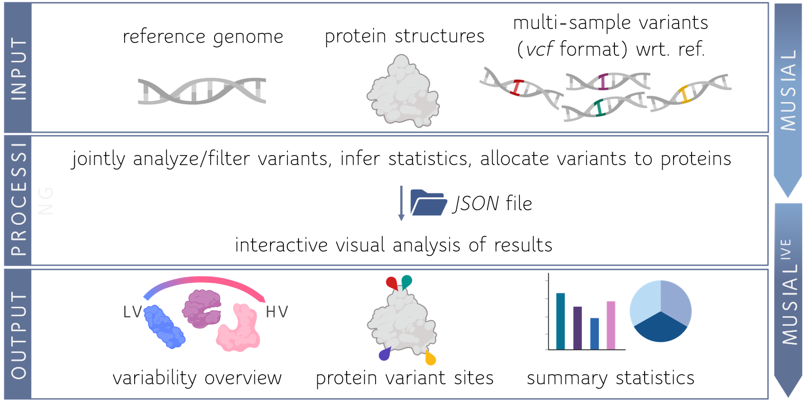

# **MUSIAL - MUlti Sample varIant AnaLysis**

`Contact:   simon.hackl@uni-tuebingen.de`

---
## **Description**:
Summarize and filter single nucleotide variant and structural variant information from multiple samples on single genes or genomes based on **.vcf** files.
The assessed variant information can be allocated to reference protein structures and visualized with the companion tool [MUSIAL IVE](https://github.com/Integrative-Transcriptomics/MUSIAL-IVE).

---
## **Dependencies and Building**:
- JDK 15+
- Gradle 7+

A precompiled **.jar** can be found in __Releases__. This program can be built with gradle (https://gradle.org).
For that just type `gradle clean build` in the projects root directory.
The **.jar** file is then contained in the `/releases` directory.

---
## **Usage**:

The compiled **.jar** can be run from any command line interface. `MUSIAL` implements different modules to execute distinct pipelines.
The common input for each pipeline is a `JSON` file which serves as a local database of variant information and can be created and maintained with the `updateVDict` module.
__For more information on how to generate a `VDict JSON` file and its `JSON Scheme` please visit the repository wiki.__
To run a module type
    
    java -jar MUSIAL-v2.1 <MODULE_NAME> <MODULE_PARAMETERS>

Currently available modules are:

      - updateVDict : Generate a new or update an existing variants dictionary JSON file.
        usage: java -jar MUSIAL-v2.1.jar updateVDict
          -C,--vDictConfig <arg>    Path to .json file yielding the parameter and
                                    input configuration to build/update a variants
                                    dictionary.
